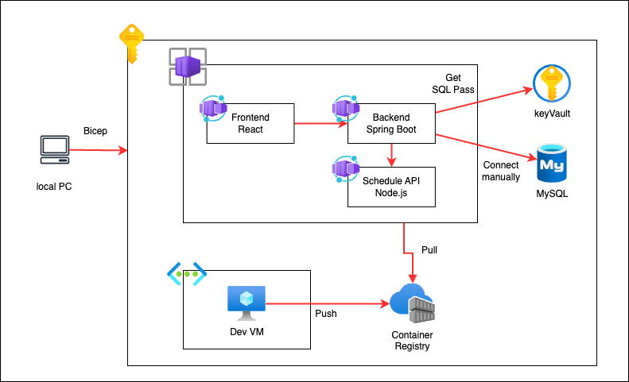

# azure-container-dev-book
『Azureコンテナアプリケーション開発』（技術評論社，2023年）のサンプルコード

## 書誌情報
Azureコンテナアプリケーション開発

- 真壁徹、東方雄亮、米倉千冬、谷津秀典、阿佐志保 著, 技術評論社, 2023, 978-4-297-13269-9
- https://gihyo.jp/book/2023/978-4-297-13269-9

本書に関するお問い合わせについては、技術評論社の書籍ページのフォームをご使用ください。

## はじめに
このリポジトリは書籍</br>
『Azureコンテナアプリケーション開発』（技術評論社，2023年）</br>
で行われているデプロイを個人学習目的でBicepにしたものです。サンプルアプリや詳細は下記の書籍をご参照ください。なお、サンプリアプリも下記の公式パブリックリポジトリからクローンしております。
### 書誌情報
Azureコンテナアプリケーション開発
- 真壁徹、東方雄亮、米倉千冬、谷津秀典、阿佐志保 著, 技術評論社, 2023, 978-4-297-13269-9
- https://gihyo.jp/book/2023/978-4-297-13269-9
- Github: https://github.com/gihyo-book/azure-container-dev-book

### Architecture


### Azure Bicep について
**概要**
Azure Bicep はAzureのインフラストラクチャのデプロイメントと管理を行うためのDSL(Domain-Specific Language)です。
- Azure bicep はAzure Resource Manager(ARM)テンプレートの記述をよりシンプルかつ人間が読みやすい形式で行うことができるツール
- BicepARMテンプレートの抽象化と拡張を提供し、より効率的なインフラストラクチャのコード化を実現
- BicepファイルはARMテンプレートに変換され、Azureリソースのデプロイに使用される
**メリット**
- シンプルな記述と読みやすさ：JSON形式のARMテンプレートよりもコンパクトで直感的な記述が可能
- 再利用性とモジュール化：Bicepはモジュール化されたコードの生成と再利用をサポートする。
- 堅安全性とエラーチェック：Bicepは静的型付けをサポートしており、コンパイル時に構文エラーやリソースの依存関係問題を検出することが可能。特にVSCode拡張機能を導入するだけで幅広い保管機能を使用することが可能
- コミュニティとエコシステムのサポート：Bicepはオープンソースプロジェクトであり、広範囲なコミュニティとサポートを受けている。また、Azure最新機能に迅速に対応。


## 環境
**ハンズオンを実施する環境は以下を想定しています**
- Azure環境
  - サブスクリプションへの共同作成者権限とユーザーアクセス管理者権限が必須
- AzureCLIが使用可能なローカルPC
  本ハンズオンでは以下の環境で実施します。
  - Macbook 
  インストールがまだの場合は公式サイトを参考にインストールとセットアップをしてください。
  https://learn.microsoft.com/ja-jp/cli/azure/install-azure-cli
  
もしBicepファイルを編集する際はVSCode拡張機能をインストールすることをお勧めします。</br>
  https://learn.microsoft.com/ja-jp/azure/azure-resource-manager/bicep/install

## 動かし方
1. ツールのメインのディレクトリー `/bicep_lab` に移動する
```bash
cd bicep_lab
```
2. 必要なモジュールをインストールする
```bash
pip install -r requirements.txt
```

3. azureにログインする
```
az login
```
🌾  ブラウザが開きます

4. 設定ファイルを記述する
ファイルパス：`/bicep_lab/config/config.yml`
- サブスクリプションIDを記述
- env_name を記述

ファイルパス：`/bicep_lab/ssh_keys/authorized_keys.ubuntu`
- ご自身の公開鍵を記述（開発VMに設定される鍵）
5. core-deployの実行
コマンドでレジストリや開発用VMのデプロイを実行。
```bash
python main.py --core-deploy --components all
```
デプロイされるコンポーネント
- ['role'],
- ['vnet', 'acr', 'keyvault'],
- ['dev_vm']
それぞれをallの代わりに指定してデプロイも可能。その際は以下のコマンド
```bash
python main.py --core-deploy --components role,vnert,acr,...
```
5. VMへのログイン
デプロイした開発VMへのログイン。初期ユーザー名は`azureadmin`と`oda`。
`oda`の中にビルドするアプリのソースがpullされている。

6. acrへのイメージプッシュ
7. 設定ファイルへのDocker Imageを記述
8. アプリのデプロイ
```bash
python main.py --apps-deploy --components all
```
デプロイされるコンポーネント
- ['db', 'app_container'],
- ['app_env'],
- ['scheduler'],
- ['backend', 'scheduler'],
- ['frontend']

## アプリコードの改修
- /apps/part3/frontend
ReactアプリがContainerAppsで設定した環境変数を使用するように修正
